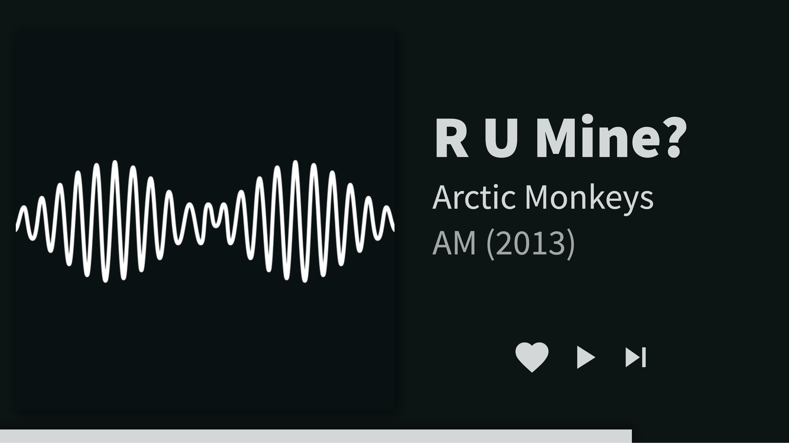

# Harvard CS50 Final Project: Spotify Status
#### Video Demo: https://youtu.be/Yc1qeze1bso

### Description:
A web app to display your currently playing song on Spotify. Allows you to skip songs, play/pause, and like/unlike. Analyzes album artwork to choose background and foreground color to match the image. Polls every two seconds to refresh the display to show your currently playing song. Scales to the size of your display using dynamic layout.

### Screenshots:

### Implementation:
I started my project by setting up a basic site to show raw JSON of my Spotify data utilizing [Spotipy](https://github.com/plamere/spotipy), an open source Spotify Python API. Later on, I wrote some javascript to poll the Spotify API every two seconds to check for changes. If the song has changed, the page is refreshed with the new info.

I compute the color palette using a javascript library called [ColorThief](https://github.com/lokesh/color-thief) which grabs the dominant color for the background, and a contrasting alternate color from the palette for the text. The text color is not just black or white, but instead samples a few alternate colors to form an entire palette, and finds a color from that palette that contrasts with the selected background color.

I use [Google Material Symbols](https://material.io/blog/introducing-symbols) for the playback control icons. This allows for easy scaling to different screen sizes without needing separate images.

### Difficulties and Struggles:
Getting arrangement of elements on screen and scaling for different displays was a challenge. I wanted it to look at least tolerable on anything from a PC with a landscape screen, to something like a mobile phone. It isn't perfect, but it's fairly solid. Additionally, finding at what point the text should be white instead of black was difficult. I had to make sure that the song details would be easily readable no matter what song was playing at that moment.

### How To Host It Yourself:
There's many different ways you can host this webapp. I personally use Fly.io. You'll also need to set up a Spotify Developer Application to get your Spotify client ID and client secret. 

Create a Spotify Developer account if you don't have one, and create a new app. You'll need to take note of the Client ID and Client Secret.
Host the webapp using one of the following 3 options:
  
#### To use Fly.io (easy-to-use host, no longer free):
  - Download the repo
  - Set up your fly.io account and create a new app
  - Take note of hostname/address your app is hosted at
  - Enter in Client ID, Client Secret, and Redirect URI (which is the address your webapp is hosted at) as environment variables SPOTIPY_CLIENT_ID, SPOTIPY_CLIENT_SECRET and SPOTIPY_REDIRECT_URI
#### Hosting locally (for debugging):
  - Install python3 and the dependencies for this project on your computer. Use your computer's environment variables to set the Client ID, Client Secret, and Redirect URI. The redirect URI will be 'http://127.0.0.1:5000' for local testing.
  - There is a debug mode available that will read your environment variables from a .env file
#### To host elsewhere:
  - You can host on anything that can run Python3 and set environment variables. Just know the address you're hosting at, that will be your Redirect URI.
    
Then go back to the Spotify Developer dashboard, and enter the Redirect URI. Make sure to remove any trailing slashes.
It should be functional! 

There is extra information on setting the environment variables and hosting locally in a large comment at the top of app.py.

### Past Goals and Future Plans:
Originally, this was a project for the Harvard CS50 course. Since then, I've been adding features of my own. You can see the original CS50 version in a separate branch. Since then, I've massively improved the color detection algorithm. There's also now a designated "raspi" branch that contains extra lines of code to call a local webserver to turn the raspberry pi's screen off when music isn't playing.

I still intend to update this to fix bugs with the color detection and screen scaling, and a couple more buttons and bonus features, and more.
